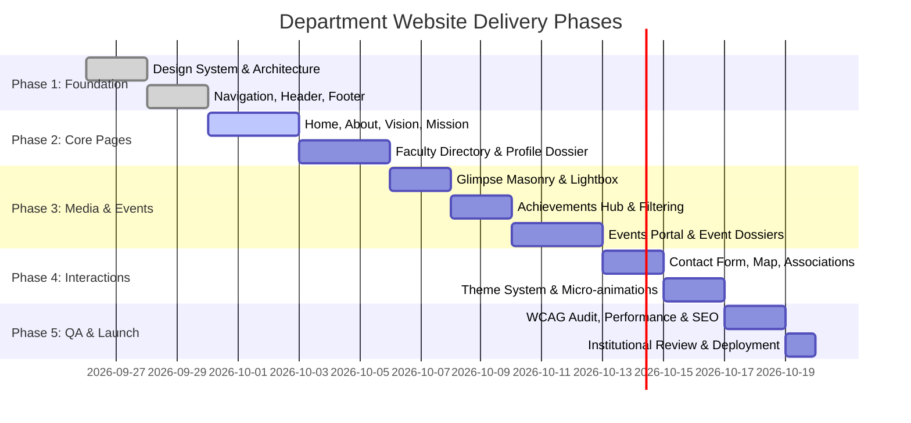

# Product Requirement Document (PRD)

**Product:** Official Department Website  
**Version:** 1.1  
**Category:** Academic & Institutional Web Application  
**Architecture:** Multi-Page Application (MPA) with Client-Side Routing  
**Target Devices:** Mobile (320px+), Tablet (768px+), Desktop (1024px+), Ultrawide (1440px+)  
**Domain Scope:** Engineering · Academia · Technology · IoT & Cybersecurity  

---

## 1. Executive Summary & Product Objective

The objective of this project is to architect, design, and deliver a modern, high-performance, and responsive official website for the **Department of IoT & Cyber Security**. The platform serves as the primary digital gateway for prospective students, current scholars, faculty, alumni, industry recruiters, and accreditation bodies.

### Core Tenets
1. **Academic Rigor & Modern Engineering:** Reflect a disciplined aesthetic that blends scholarly tradition with cutting-edge cybersecurity and computing technology.
2. **Dedicated Deep Content Architecture:** Strictly avoid single-page design anti-patterns. Each primary functional area (About, Vision, Mission, Faculty, Glimpse, Achievements, Associations, Events, Contact) exists at its own canonical URL with dedicated metadata.
3. **Responsive & Mobile-First Foundation:** Zero horizontal overflow, unclipped fluid typography, accessible touch targets (minimum 44x44px), and native drawer navigation for viewports down to 320px.
4. **Performance & Accessibility Excellence:** Built to achieve sub-second LCP (Largest Contentful Paint), zero layout shifts (CLS < 0.05), and full compliance with WCAG 2.2 AA accessibility standards.

---

## 2. Information Architecture & Sitemap

```
/ (Home)
│
├── /about                     [Department Overview, History, Infrastructure]
├── /vision                    [Official Vision, Strategic Aspirations]
├── /mission                   [Pillars: Education, Research, Ethical Tech]
│
├── /faculty                   [Directory: HOD, Professors, Assistant Profs]
│   └── /faculty/[slug]        [Faculty Dossier: Research, Bio, Publications]
│
├── /glimpse                   [Masonry Gallery & Lightbox: Labs, Campus Life]
├── /achievements              [Interactive Filterable Achievements Hub]
├── /association               [Clubs, Student Chapters, Industry MoUs]
│   └── /association/[slug]    [Optional: Chapter Detail & Initiatives]
│
├── /events                    [Events Portal & Category Explorer]
│   └── /events/[slug]         [Event Details, Keynotes, & Media Gallery]
│
└── /contact                   [Interactive Map, Institutional Contacts, Form]
```

### Primary Navigation Specification
* **Brand Anchor:** Department Logo + Title links permanently to `/`.
* **Desktop Navigation Bar:** Grouped hierarchy with clean dropdowns or mega-menu to preserve visual hierarchy without clutter.
* **Theme Controller:** Persistent Light / Dark mode toggle with local storage persistence and system preference synchronization.
* **Mobile Drawer:** Slide-out modal drawer with focus trapping, ARIA-expanded states, and keyboard escape bindings.

---

## 3. Page Specifications & Content Matrix

### 3.1 Home (`/`)
* **Role:** Architectural gateway and curated executive summary. Not a 15-section infinite-scroll dump; every module provides an editorial preview and routes directly to the dedicated page.
* **Core Sections:**
  1. **Hero Section:** High-impact institutional typography, value proposition, badges for NBA/NAAC accreditation, quick action links (*Explore Programs*, *View Faculty*).
  2. **Department Overview:** Brief executive summary of academic philosophy and IoT/Cyber focus.
  3. **Key Metrics Bar:** Counter stats (e.g., *Placements %*, *Research Papers*, *Patents*, *Active Student Chapters*, *State-of-the-Art Labs*).
  4. **Vision & Mission Previews:** Dual summary cards with explicit CTA buttons (`/vision`, `/mission`).
  5. **Featured Faculty:** Highlights of Department Leadership & Key Researchers with link to `/faculty`.
  6. **Visual Glimpse Strip:** High-resolution preview of advanced laboratories and student innovation.
  7. **Recent Achievements:** Showcase of latest hackathon wins, grants, and student awards.
  8. **Upcoming / Recent Events:** Cards showcasing premier conferences, workshops, and guest lectures.
  9. **Professional Associations:** Quick-view ribbon of IEEE, ACM, CSI, or IIC student chapters.
  10. **Institutional Contact CTA:** Direct invitation for prospective students, recruiters, and collaborators.

---

### 3.2 About Department (`/about`)
* **Route:** `/about`
* **Purpose:** Authoritative history, operational strengths, and academic ecosystem.
* **Content Modules:**
  * **Introduction & Genesis:** Inception, milestones, and evolution.
  * **Academic Programs:** B.Tech, M.Tech, Ph.D. pathways with curricula overviews.
  * **Specialization Domains:** Embedded Systems, IoT Architectures, Ethical Hacking, Cloud Security, Cryptography.
  * **Research Ecosystem:** Dedicated labs, funded projects, patents, and faculty citations.
  * **Infrastructure Showcase:** High-performance computing clusters, IoT testing benches, and digital forensics labs.
  * **Industry Partnerships:** MoUs, guest corporate lectures, internship pipelines, and co-branded labs.

---

### 3.3 Vision (`/vision`)
* **Route:** `/vision`
* **Visual Style:** Minimalist, editorial, high typographic presence.
* **Structure:**
  * **Primary Vision Statement:** Featured prominently in calibrated serif/sans editorial scale.
  * **Strategic Pillars:**
    * *Academic Excellence:* Rigorous curricula aligning with global industry standards.
    * *Pioneering Innovation:* Spearheading patents, startups, and applied research.
    * *Ethical Technology:* Instilling cybersecurity governance, privacy protection, and integrity.
    * *Future Horizon:* Roadmap for emerging paradigms (Quantum Cryptography, AI in Cyber Defense).

---

### 3.4 Mission (`/mission`)
* **Route:** `/mission`
* **Structure:** Structured modular grid with dedicated visual thematic blocks.
* **Pillars:**
  1. **Quality Pedagogy:** Experiential learning, hackathon-driven curricula, and peer collaboration.
  2. **Advanced Research:** Fostering high-impact publications, Ph.D. mentorship, and grant acquisition.
  3. **Industry Integration:** Bridging academia and market needs via live capstone projects and corporate mentorship.
  4. **Holistic Student Leadership:** Ethical hacking ethos, cyber safety outreach, and technical community leadership.
  5. **Social Impact:** Democratizing tech education and organizing regional cyber safety initiatives.

---

### 3.5 Faculty Directory & Profiles

#### A. Directory (`/faculty`)
* **Structure:** Tiered academic hierarchy:
  1. Head of Department (HOD)
  2. Professors
  3. Associate Professors
  4. Assistant Professors
  5. Technical & Support Staff
* **Card Specifications:**
  * Professional photograph with fallback avatar.
  * Full Name & Highest Credentials (e.g., Ph.D., Post-Doc).
  * Academic Designation.
  * Core Specialization (e.g., *Network Forensics, Cryptanalysis*).
  * Direct action: `[View Full Dossier →]`.

#### B. Individual Faculty Dossier (`/faculty/[slug]`)
* **Example:** `/faculty/dr-harpreet-singh`
* **Content:**
  * High-resolution portrait & biographical statement.
  * Qualifications & Alma Mater.
  * Academic experience (teaching, industry, research).
  * Specializations & Teaching Courses.
  * Selected Journal / Conference Publications (Scopus / IEEE / SCI).
  * Patents, Grants, & Ongoing Projects.
  * Professional Certifications (CISSP, CEH, CISM) & Professional Bodies (IEEE, ACM).
  * Official institutional email, office hours, and cabin location.

---

### 3.6 Department Glimpse (`/glimpse`)
* **Route:** `/glimpse`
* **Layout:** Asymmetric, editorial masonry layout (not a generic square grid).
* **Category Filters:**
  * `All` · `Laboratories` · `Smart Classrooms` · `Hackathons` · `Workshops` · `Campus Life` · `Projects`
* **Lightbox System:**
  * Fullscreen high-resolution modal with smooth backdrop blur (`backdrop-blur-md`).
  * Keyboard navigation (`←` previous, `→` next, `Esc` dismiss).
  * Image metadata: Title, descriptive caption, timestamp, and location.
  * Touch-swipe support on mobile viewports.

---

### 3.7 Achievements Hub (`/achievements`)
* **Route:** `/achievements`
* **Functionality:** Real-time client-side category filtering without full page reload.
* **Categories:**
  * `All` · `Students` · `Faculty` · `Research & Patents` · `Hackathons` · `Awards`
* **Card Details:**
  * Badge/Icon of Award / Distinction.
  * Title of Achievement.
  * Recipient (Individual Scholar or Project Team).
  * Host Organization / Competition (e.g., *Smart India Hackathon, IEEE International*).
  * Date & Year.
  * Project Summary & Impact Metric.
  * Accompanying photograph / certificate where available.

---

### 3.8 Professional Associations & Chapters (`/association`)
* **Route:** `/association`
* **Entities:**
  * Student Technical Clubs (e.g., *Cyber Defense Club, IoT Makers Club*).
  * Professional Chapters (e.g., *ACM Student Chapter, IEEE Communications Society*).
  * Department Societies & Innovation Incubators.
* **Card / Detail Modules:**
  * Official Logo & Emblems.
  * Mandate & Annual Objectives.
  * Executive Committee (Faculty Advisor & Student Leads).
  * Flagship Annual Events & Coding Contests.
  * External Portal / Registration Links.

---

### 3.9 Events Portal & Event Dossiers

#### A. Events Hub (`/events`)
* **Categories:** `Conferences` · `Workshops` · `Guest Lectures` · `Hackathons` · `Webinars`
* **Timeline Segregation:** `Upcoming Events` vs. `Archived Events`.
* **Card Elements:**
  * Event Banner / Thumbnail.
  * Category badge.
  * Date, Time, and Physical Venue / Virtual Link.
  * Concise abstract.
  * Link to `[View Full Event & Gallery →]`.

#### B. Event Detail Page (`/events/[slug]`)
* **Example:** `/events/annual-cyber-summit-2026`
* **Dossier Content:**
  * Complete Event Abstract & Agenda.
  * Speaker Profiles, Designations, & Topics.
  * Key Takeaways & Measurable Outcomes.
  * **Dedicated Photo Gallery:** Masonry photo gallery specific to that event with integrated lightbox viewer.

---

### 3.10 Contact & Campus Reach (`/contact`)
* **Route:** `/contact`
* **Information:**
  * Department Name & Institutional Affiliation.
  * Postal Address, Building, and Floor Coordinates.
  * Official Department Email & Grievance Helpline.
  * Office Working Hours & Visitor Guidelines.
* **Interactive Map:**
  * Embedded responsive campus map with custom accessibility markers.
* **Direct Inquiry Form:**
  * Fields: Full Name, Email, Contact Number, Subject Selection, Message Body.
  * Client-side validation + server action processing with feedback notifications.

---

## 4. UI/UX Design System & Sensory Guidelines

### 4.1 Visual Personality
* **Archetype:** Institutional Engineering meets Technical Precision.
* **Mood:** Deep, authoritative, intelligent, spacious, and trustworthy.
* **Anti-Slop Directives:**
  * ❌ NO neon green cyberpunk glows or arbitrary dark meshes.
  * ❌ NO generic purple/pink AI gradients.
  * ❌ NO cluttered cards-inside-cards syndrome.
  * ❌ NO emoji substitutions for professional icons.
  * ✅ Refined typography pairings (editorial serif headers with clean monospace/sans technical body).
  * ✅ Mathematical, consistent spacing scale (4px, 8px, 16px, 24px, 32px, 48px, 64px).
  * ✅ High-contrast border delineations (`border-border/60` with subtle glass effects where appropriate).

### 4.2 Light & Dark Color Architecture

| Token Name | Light Mode (Default) | Dark Mode (Academic Dark) | Usage |
| :--- | :--- | :--- | :--- |
| `background` | `#F8FAFC` (Slate 50) | `#0B0F19` (Deep Navy Black) | Page canvases |
| `surface` | `#FFFFFF` (Pure White) | `#111827` (Rich Gray 900) | Card components, sheets |
| `surface-subtle`| `#F1F5F9` (Slate 100) | `#1E293B` (Slate 800) | Hover states, pill badges |
| `primary` | `#0F2042` (Deep Navy) | `#38BDF8` (Luminous Cyan) | Key headlines, brand accent |
| `accent` | `#2563EB` (Cobalt Blue) | `#0284C7` (Sky Blue) | Buttons, active navigation |
| `text-primary` | `#0F172A` (Slate 900) | `#F8FAFC` (Slate 50) | Primary headlines, titles |
| `text-muted` | `#64748B` (Slate 500) | `#94A3B8` (Slate 400) | Metadata, body descriptions |
| `border` | `#E2E8F0` (Slate 200) | `#1E293B` (Slate 800) | Card dividers, gridlines |

---

## 5. Responsive Viewport Matrix

| Component | Mobile (`<768px`) | Tablet (`768px - 1023px`) | Desktop (`1024px - 1439px`) | Ultrawide (`1440px+`) |
| :--- | :--- | :--- | :--- | :--- |
| **Faculty Grid** | 1 Column | 2 Columns | 3 Columns | 4 Columns |
| **Events Hub** | 1 Column | 2 Columns | 3 Columns | 3 Columns |
| **Achievements** | 1 Column | 2 Columns | 3 Columns | 3 Columns |
| **Gallery Masonry** | 2 Columns | 3 Columns | 4 Columns | 4 Columns |
| **Navigation** | Hamburger Drawer | Compact Top Bar | Full Header Menu | Full Header Menu |
| **Container Padding** | `px-4` (16px) | `px-8` (32px) | `px-12` (48px) | `px-16` (64px) |

---

## 6. Component Architecture Hierarchy

```
components/
├── navigation/
│   ├── Navbar.tsx             # Global sticky header with grouped menus
│   ├── MobileDrawer.tsx       # Slide-out navigation with focus trapping
│   ├── Breadcrumb.tsx         # Hierarchical route breadcrumb trail
│   └── Footer.tsx             # Comprehensive institutional footer
│
├── common/
│   ├── PageHeader.tsx         # Standardized page title, badge, and abstract
│   ├── SectionHeader.tsx      # Curated section header with subtitle
│   ├── ThemeToggle.tsx        # Light/Dark mode switcher
│   └── Lightbox.tsx           # Accessible full-screen image viewer
│
├── faculty/
│   ├── FacultyCard.tsx        # Standard directory item card
│   └── FacultyFilter.tsx      # Designation & research area switcher
│
├── events/
│   ├── EventCard.tsx          # Event summary preview card
│   └── EventGallery.tsx       # Dedicated photo grid for event detail pages
│
├── achievements/
│   ├── AchievementCard.tsx    # Card displaying recipient, organization, date
│   └── CategoryTabs.tsx       # Zero-reload filter buttons
│
├── glimpse/
│   └── MasonryGrid.tsx        # Dynamic column masonry with lightbox hooks
│
└── contact/
    ├── ContactForm.tsx        # Accessible inquiry form with validation
    └── CampusMap.tsx          # Embedded responsive map container
```

---

## 7. Non-Functional Specifications

### 7.1 Accessibility (WCAG 2.2 AA)
* Minimum color contrast ratio of 4.5:1 for normal text and 3:1 for large display titles.
* All interactive buttons, cards, and anchors must exhibit distinct focus-visible rings (`ring-2 ring-primary`).
* Keyboard escape bindings on all modals, lightboxes, and mobile drawer panels.
* Explicit `aria-label`, `aria-expanded`, and semantic HTML landmarks (`<main>`, `<header>`, `<nav>`, `<article>`).
* Respect for user preference via `prefers-reduced-motion`.

### 7.2 Performance & Core Web Vitals
* **Target LCP:** ≤ 1.2s on standard 4G networks.
* **Target CLS:** ≤ 0.02 (zero jumping layout elements).
* **Target INP:** ≤ 100ms.
* Native Next.js Image component (`next/image`) with modern WebP/AVIF compression, `sizes` attributes, and blur placeholding.
* Route pre-fetching for instant navigation between academic pages.

### 7.3 Security Posture
* Built-in Cross-Site Scripting (XSS) prevention via React/Next.js sanitization.
* Form rate-limiting and honeypot validation on `/contact` submissions.
* Standard security headers: `Content-Security-Policy`, `X-Frame-Options: DENY`, `X-Content-Type-Options: nosniff`.
* Zero storage of sensitive institutional tokens or environment variables in client bundles.

---

## 8. Recommended Implementation Stack

| Layer | Technology | Rationale |
| :--- | :--- | :--- |
| **Framework** | Next.js 14+ (App Router) | Enterprise-grade routing, SSR for SEO, optimal image optimization |
| **Language** | TypeScript | Strict type safety for complex faculty dossiers and event metadata |
| **Styling** | Tailwind CSS | Utility-first, zero runtime overhead, responsive utility classes |
| **UI Primitives** | shadcn/ui (Radix UI) | Unstyled, fully accessible primitives (Dialog, Dropdown, Tabs) |
| **Motion** | Motion (`motion/react`) | Fluid, performant transitions and layout animations |
| **Icons** | Lucide React | Clean, modern, lightweight SVG iconography |
| **Image Hosting** | Cloudinary / Cloudflare R2 | High-throughput image transformation and CDN caching |

---

## 9. Phased Delivery Roadmap



---

## 10. Verification Matrix

| Route | Minimum Content Items | Visual Check | Responsive Verification |
| :--- | :--- | :--- | :--- |
| `/` | 10 Preview Modules | Header, Hero, Stats, CTA | 320px, 768px, 1024px, 1440px |
| `/about` | History, Specializations, Labs | Structured layout with breadcrumb | No text clipping or overflow |
| `/vision` | Vision statement + 4 Pillars | Clean typographic layout | Balanced text wrapping |
| `/mission` | 5 Mission blocks | Modular cards with iconography | Stacks to 1 column on mobile |
| `/faculty` | 12+ Faculty across tiers | Tiered grid with search/filter | 1 col mobile, 4 col desktop |
| `/faculty/[slug]` | Comprehensive academic dossier | Research publications & contact | Tabbed or cleanly segmented sections |
| `/glimpse` | 15+ Categorized images | Masonry grid + modal lightbox | Touch swipe & key navigation |
| `/achievements` | 10+ Achievements with filters | Real-time category filtering | Instant tab transitions |
| `/association` | 4+ Clubs & Chapters | Emblems, mandates, initiatives | Clean grid layout |
| `/events` | Upcoming & Archived events | Categorized event cards | Seamless routing to detail page |
| `/events/[slug]` | Agenda, speakers, event gallery | Dedicated gallery + lightbox | Full media modal test |
| `/contact` | Map, contact details, form | Validated responsive form | Accessible keyboard inputs |
